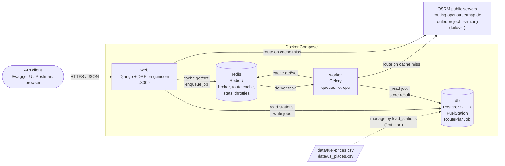
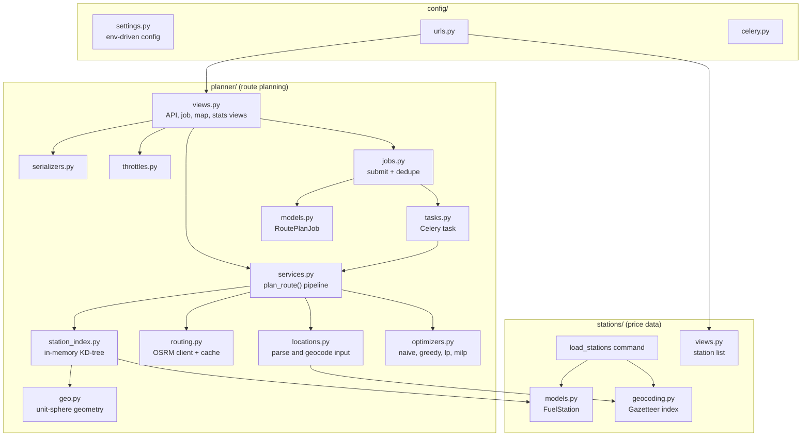
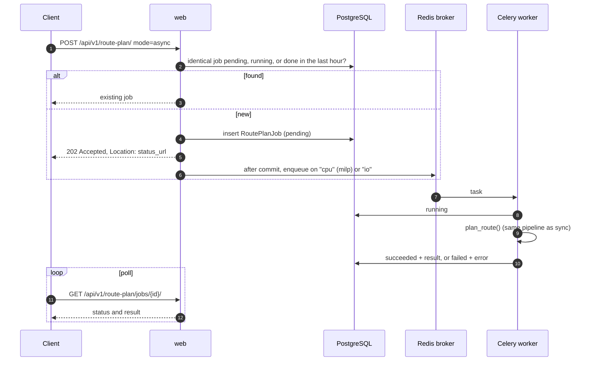

# Architecture

How the Fuel Route Planner API is put together: the services it runs, the libraries it uses, and
how a request moves through them. For the optimisation maths see [MATH.md](MATH.md); for setup
and the API reference see the [README](../README.md).

## Tech stack

| Layer | Technology | Version | Used for |
| --- | --- | --- | --- |
| Language | Python | 3.14 | Everything server side |
| Web framework | Django | 6.1 | Models, ORM, admin, templates, cache framework |
| API | Django REST Framework | 3.18 | Views, serializers, pagination, throttling |
| API docs | drf-spectacular | 0.30 | OpenAPI 3 schema, Swagger UI, ReDoc |
| App server | gunicorn | 26.2 | 3 workers × 4 threads, `--preload` |
| Static files | WhiteNoise | 6.12 | Serves admin and Swagger assets from gunicorn |
| Database | PostgreSQL | 17 (Alpine) | Fuel stations and background job state. SQLite locally. |
| Cache and broker | Redis | 7 (Alpine) | Route cache, routing stats, throttle counters, Celery queue |
| Background jobs | Celery | 5.6 | `mode=async` plans on the `io` and `cpu` queues |
| Routing | OSRM (public servers) | HTTP API v1 | Driving route geometry and distance, one call per new route |
| Geocoding | US Census Gazetteer 2025 | `data/us_places.csv` | Offline "City, ST" to coordinates, no API |
| Numerics | NumPy | 2.5 | Vectorised route and station geometry |
| Spatial index | SciPy `KDTree` | 1.18 | Matching stations to the route in memory |
| Optimisation | SciPy `linprog` / `milp` (HiGHS) | 1.18 | The `lp` and `milp` strategies |
| Polyline decoding | polyline | 2.0 | Decoding OSRM's `polyline6` geometry |
| HTTP client | requests | 2.34 | Calls to OSRM with timeout and failover |
| Map page | Leaflet | 1.9.4 (cdnjs) | `/route-plan/map/` with the route and numbered stops |
| Config | python-dotenv, dj-database-url | | Environment-driven settings, `.env` support |
| Containers | Docker, Docker Compose | | `web`, `worker`, `db`, `redis` |
| Tests | pytest, pytest-django | 9.1, 4.14 | Unit and API tests |
| Packaging | uv | | `pyproject.toml` + `uv.lock`, exported to `requirements*.txt` |

## System overview



| Service | Image | Role |
| --- | --- | --- |
| `web` | built from `Dockerfile` | Runs migrations and the station import on first start (`docker-entrypoint.sh`), then serves the API. Answers `greedy`/`lp` plans directly and queues `mode=async` requests. |
| `worker` | same image as `web` | Celery worker with concurrency 4. Runs queued plans: `milp` on the `cpu` queue, everything else on `io`. |
| `db` | `postgres:17-alpine` | Durable data. Stations are stored once and loaded into memory by each process. |
| `redis` | `redis:7-alpine` | Short-lived shared state: the Celery broker, cached OSRM routes (one week), routing stats counters and DRF throttle counters. |

Web and worker hold no per-request state, so both scale by adding containers
(`docker compose up --scale worker=3`).

## Code layout



- `stations` owns the price data: the `FuelStation` model, the offline geocoder, the CSV import
  and the `/api/v1/stations/` list.
- `planner` owns everything about a trip. `services.plan_route()` is the single pipeline, and
  both the synchronous view and the Celery task call it, so the two paths cannot drift apart.

## Request lifecycle

### Synchronous plan (`mode=sync`, the default)

```mermaid
sequenceDiagram
  autonumber
  participant C as Client
  participant W as web (DRF view)
  participant R as Redis cache
  participant O as OSRM
  participant M as In-memory station index

  C->>W: POST /api/v1/route-plan/
  W->>W: throttles, validate, geocode offline
  W->>R: get cached route
  alt cache hit
    R-->>W: route (0 API calls)
  else cache miss
    W->>O: GET /route/v1/driving/{lng,lat;lng,lat}
    O-->>W: polyline6 geometry + distance
    W->>R: store route for 7 days
  end
  W->>M: stations within max_detour_miles of the route
  M-->>W: candidates with mile markers
  W->>W: build fuel problem, run strategy
  W-->>C: 200 plan (stops, cost, savings, GeoJSON, map_url)
```

### Background plan (`mode=async`)



### Planning pipeline

| Step | Module | What happens | Typical time |
| --- | --- | --- | --- |
| Geocode | `locations.py` | `"City, ST"` or `"lat,lng"` resolved against the Census Gazetteer in memory | < 1 ms |
| Route | `routing.py` | Cache lookup, then one OSRM call on a miss, with failover to a second server | 1–3 s on a miss, a few ms on a hit |
| Match stations | `station_index.py` | Route densified to 1 mile steps, KD-tree query of every station, cheapest per town kept | 5–20 ms |
| Optimise | `optimizers.py` | Feasibility check, then `greedy`, `lp`, `milp` or `naive` | ~0.1 ms greedy, ~12 ms lp, up to 2 s milp |
| Serialize | `services.py` | Stops, totals, savings vs naive and vs average price, simplified GeoJSON | ~1 ms |

## Data

```mermaid
erDiagram
  FuelStation {
    int id PK
    int opis_id UK
    string name
    string address
    string city
    string state
    int rack_id
    decimal retail_price
    float latitude "null if city not matched"
    float longitude "null if city not matched"
  }
  RoutePlanJob {
    uuid id PK
    string params_hash "dedupe key"
    json params
    string status "pending, running, succeeded, failed"
    json result
    int error_status
    string error_detail
    datetime created_at
    datetime started_at
    datetime finished_at
  }
```



- **FuelStation** is loaded from `data/fuel-prices.csv` by `manage.py load_stations`. The import
  drops Canadian rows, keeps the cheapest price per OPIS id, and geocodes each station to its
  city centroid. It replaces the table in one transaction, so re-running it is safe.
- **RoutePlanJob** holds background job state and results. Celery's own result backend is
  disabled, so job state survives worker restarts and is visible in the Django admin.
- **Redis** holds only data that can be rebuilt: cached routes, stats counters and throttle
  windows.

## Design decisions

| Decision | Why |
| --- | --- |
| Offline geocoding from the Census Gazetteer | Station addresses are highway exits that geocode poorly, and a local lookup needs no API call or key. |
| One OSRM call per route, cached for a week | The public OSRM servers are free but slow (1–3 s) and rate-limited. Repeat trips cost nothing. |
| In-memory KD-tree instead of PostGIS | About 6,500 stations fit in a few hundred KB. Matching takes milliseconds with no spatial database to run. |
| Greedy as the default strategy | Proven optimal when fuel is divisible, matches the LP on every benchmark route, and is about 100× faster. |
| Celery with separate `io` and `cpu` queues | `milp` solves and uncached routes are the slow paths. Moving them off gunicorn keeps fast requests fast. |
| Job state in PostgreSQL, deduplicated by input hash | Durable across restarts, visible in the admin, and identical requests share one computation. |
| Redis for cache and broker, with fallbacks | Without `REDIS_URL` the app uses the database cache and runs tasks inline, so it works locally with no extra services. |

## Configuration

All settings come from environment variables (see `.env.example`).

| Variable | Default | Effect |
| --- | --- | --- |
| `DATABASE_URL` | SQLite file | PostgreSQL in Docker |
| `REDIS_URL` | unset | Enables the Redis cache and real Celery workers |
| `OSRM_BASE_URLS` | the two public servers | Comma-separated, tried in order. Point at a self-hosted OSRM for production. |
| `OSRM_TIMEOUT_SECONDS` | `10` | Per-server timeout |
| `ROUTE_CACHE_SECONDS` | `604800` (7 days) | Route cache lifetime |
| `THROTTLE_SYNC_MILP` | `10/min` | Limit for synchronous `milp` per client |
| `THROTTLE_JOBS` | `60/min` | Limit for job submissions per client |
| `DJANGO_SECRET_KEY`, `DJANGO_DEBUG`, `DJANGO_ALLOWED_HOSTS` | dev values | Standard Django settings |
